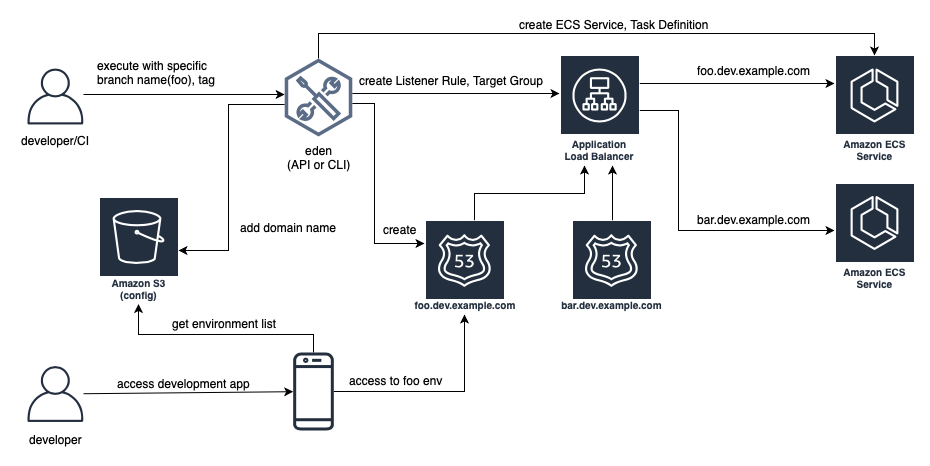

# ECS Dynamic Environment Manager (eden) API 

Terraform module for Amazon ECS Dynamic Environment Manager (eden) API

Clone Amazon ECS environments easily. 
Provide eden IP with a reference ECS service and eden will create/delete clones.

eden is provided in CLI and Terraform module (Lambda with API Gateway REST API) flavors. 
You can use API Gateway REST API from CI of your choice on Pull Request open/close, 
new commit pushes to fully automate environment creation. 
eden API is fast - both create and delete commands usually take no more than 5 seconds.

For CLI flavor, see aws-eden-cli at [GitHub](https://github.com/baikonur-oss/aws-eden-cli).


## Developing with eden



## Usage (API interface)
```HCL
module "eden" {
  source  = "baikonur-oss/lambda-eden-api/aws"
  version = "0.2.0"

  lambda_package_url = "https://github.com/baikonur-oss/terraform-aws-lambda-eden-api/releases/download/v0.2.0/lambda_package.zip"
  name                  = "eden"

  # eden API ALB variables
  api_acm_certificate_arn     = "${data.aws_acm_certificate.wildcard.arn}"
  api_domain_name             = "${var.env}-eden.${data.aws_route53_zone.main.name}"
  api_zone_id                 = "${data.aws_route53_zone.main.zone_id}"

  endpoints_bucket_name = "somebucket"

  dynamic_zone_id       = "${data.aws_route53_zone.dynamic.zone_id}"
}
```

Warning: DynamoDB table for state management is created by aws-eden-cli. Make sure to run `eden config --push` with success at least once before terraform apply. Default table name is `eden`.

With multiple profiles, one eden API instance is enough for one account/region. Refer to aws-eden-cli examples for more details.

### eden API
eden has only two API commands: create and delete.

#### `GET /api/v1/create`
Required query parameters:
- name: environment name 
- image_uri: ECR image URI to deploy, must be already pushed and must be in the same account (eden API will check for image availability before deploying)

Optional query parameters:
- profile: default value = "default". eden profile to use. Profiles include all settings necessary. Profiles can be created with `eden config --push` command. Refer to aws-eden-cli examples for more details.

#### `GET /api/v1/delete`
Required query parameters:
- name: environment name 

Optional query parameters:
- profile: default value = "default". eden profile to use. Profiles include all settings necessary. Profiles can be created with `eden config --push` command. Refer to aws-eden-cli examples for more details.


### API Keys
This module creates an API Key for you. You can check it from API Gateway console. You will need to specify this key to access API. 

Key must be provided as an HTTP header:
```
x-api-key: YOURAPIKEY
```
 

### Example
#### Create API
`curl https://eden.example.com/api/v1/create?name=test-create&image_uri=xxxxxxxxxxxx.dkr.ecr.ap-northeast-1.amazonaws.com/servicename-api-dev:latest&profile=api -H "x-api-key:YOURAPIKEY"`

```
2019-04-08T20:32:05.151Z INFO     [main.py:check_cirn:382] Checking if image xxxxxxxxxxxx.dkr.ecr.ap-northeast-1.amazonaws.com/servicename-api-dev:latest exists 
2019-04-08T20:32:05.270Z INFO     [main.py:check_cirn:401] Image exists 
2019-04-08T20:32:05.446Z INFO     [main.py:create_env:509] Retrieved reference service arn:aws:ecs:ap-northeast-1:xxxxxxxxxxxx:service/dev/dev01-api 
2019-04-08T20:32:05.484Z INFO     [main.py:create_task_definition:58] Retrieved reference task definition from arn:aws:ecs:ap-northeast-1:xxxxxxxxxxxx:task-definition/dev01-api:15 
2019-04-08T20:32:05.557Z INFO     [main.py:create_task_definition:96] Registered new task definition: arn:aws:ecs:ap-northeast-1:xxxxxxxxxxxx:task-definition/dev-dynamic-test-create:1 
2019-04-08T20:32:05.584Z INFO     [main.py:create_target_group:112] Retrieved reference target group: arn:aws:elasticloadbalancing:ap-northeast-1:xxxxxxxxxxxx:targetgroup/dev01-api/9c68a5f91f34d9a4 
2019-04-08T20:32:05.611Z INFO     [main.py:create_target_group:125] Existing target group dev-dynamic-test-create not found, will create new 
2019-04-08T20:32:06.247Z INFO     [main.py:create_target_group:144] Created target group 
2019-04-08T20:32:06.310Z INFO     [main.py:create_alb_host_listener_rule:355] ELBv2 listener rule for target group arn:aws:elasticloadbalancing:ap-northeast-1:xxxxxxxxxxxx:targetgroup/dev-dynamic-test-create/b6918e6e5f10389d and host api-test-create.dev.example.com does not exist, will create new listener rule 
2019-04-08T20:32:06.361Z INFO     [main.py:create_env:554] ECS Service dev-dynamic-test-create does not exist, will create new service 
2019-04-08T20:32:07.672Z INFO     [main.py:check_record:414] Checking if record api-test-create.dev.example.com. exists in zone Zxxxxxxxxxxxx 
2019-04-08T20:32:08.133Z INFO     [main.py:create_cname_record:477] Successfully created ALIAS: api-test-create.dev.example.com -> dev-alb-api-dynamic-xxxxxxxxx.ap-northeast-1.elb.amazonaws.com 
2019-04-08T20:32:08.134Z INFO     [main.py:create_env:573] Successfully finished creating environment dev-dynamic-test-create 
```
#### Create API on existing env
`curl https://eden.example.com/api/v1/create?name=test&image_uri=xxxxxxxxxxxx.dkr.ecr.ap-northeast-1.amazonaws.com/servicename-api-dev:latest&profile=api -H "x-api-key:YOURAPIKEY"`

```
2019-04-08T20:30:13.491Z INFO     [main.py:check_cirn:382] Checking if image xxxxxxxxxxxx.dkr.ecr.ap-northeast-1.amazonaws.com/servicename-api-dev:latest exists 
2019-04-08T20:30:13.553Z INFO     [main.py:check_cirn:401] Image exists 
2019-04-08T20:30:13.692Z INFO     [main.py:create_env:509] Retrieved reference service arn:aws:ecs:ap-northeast-1:xxxxxxxxxxxx:service/dev/dev01-api 
2019-04-08T20:30:13.721Z INFO     [main.py:create_task_definition:58] Retrieved reference task definition from arn:aws:ecs:ap-northeast-1:xxxxxxxxxxxx:task-definition/dev01-api:15 
2019-04-08T20:30:13.788Z INFO     [main.py:create_task_definition:96] Registered new task definition: arn:aws:ecs:ap-northeast-1:xxxxxxxxxxxx:task-definition/dev-dynamic-test:5 
2019-04-08T20:30:13.807Z INFO     [main.py:create_target_group:112] Retrieved reference target group: arn:aws:elasticloadbalancing:ap-northeast-1:xxxxxxxxxxxx:targetgroup/dev01-api/9c68a5f91f34d9a4 
2019-04-08T20:30:13.827Z INFO     [main.py:create_target_group:147] Target group dev-dynamic-test already exists, skipping creation 
2019-04-08T20:30:13.877Z INFO     [main.py:create_alb_host_listener_rule:351] ELBv2 listener rule for target group arn:aws:elasticloadbalancing:ap-northeast-1:xxxxxxxxxxxx:targetgroup/dev-dynamic-test/xxxxxxxx already exists, skipping creation 
2019-04-08T20:30:13.926Z INFO     [main.py:create_env:538] ECS Service dev-dynamic-test already exists, skipping creation 
2019-04-08T20:30:13.926Z INFO     [main.py:create_env:539] Will deploy task definition arn:aws:ecs:ap-northeast-1:xxxxxxxxxxxx:task-definition/dev-dynamic-test:5 to service dev-dynamic-test 
2019-04-08T20:30:14.429Z INFO     [main.py:create_env:549] Successfully deployed task definition arn:aws:ecs:ap-northeast-1:xxxxxxxxxxxx:task-definition/dev-dynamic-test:5 to service dev-dynamic-test in cluster dev 
2019-04-08T20:30:15.248Z INFO     [main.py:check_record:414] Checking if record api-test.dev.example.com. exists in zone Zxxxxxxxxxxxx 
2019-04-08T20:30:15.552Z INFO     [main.py:check_record:425] Found existing record api-test.dev.example.com. in zone Zxxxxxxxxxxxx 
2019-04-08T20:30:15.552Z INFO     [main.py:create_cname_record:450] ALIAS record already exists, doing nothing: api-test.dev.example.com -> dev-alb-api-dynamic-xxxxxxxxx.ap-northeast-1.elb.amazonaws.com 
2019-04-08T20:30:15.552Z INFO     [main.py:create_env:573] Successfully finished creating environment dev-dynamic-test 
```

#### Delete API (existing env)
`curl https://eden.example.com/api/v1/delete?name=test&profile=api -H "x-api-key:YOURAPIKEY"`

```
2019-04-10T23:11:38.515Z INFO     [main.py:check_record:495] Checking if record api-test.dev.example.com. exists in zone Zxxxxxxxxxxxx 
2019-04-10T23:11:38.752Z INFO     [main.py:check_record:506] Found existing record api-test.dev.example.com. in zone Zxxxxxxxxxxxx 
2019-04-10T23:11:38.996Z INFO     [main.py:delete_cname_record:596] Successfully removed ALIAS record api-test.dev.example.com 
2019-04-10T23:11:39.245Z INFO     [main.py:delete_env:665] ECS Service dev-dynamic-test exists, will delete 
2019-04-10T23:11:39.401Z INFO     [main.py:delete_env:670] Successfully deleted service dev-dynamic-test from cluster dev 
2019-04-10T23:11:39.573Z INFO     [main.py:delete_alb_host_listener_rule:397] ELBv2 listener rule for target group arn:aws:elasticloadbalancing:ap-northeast-1:xxxxxxxxxxxx:targetgroup/dev-dynamic-test/xxxxxxxx and host api-test.dev.example.com found, will delete 
2019-04-10T23:11:40.483Z INFO     [main.py:delete_env:697] Deleted all task definitions for family: dev-dynamic-test, 5 tasks deleted total 
2019-04-10T23:11:40.483Z INFO     [main.py:delete_env:700] Successfully finished deleting environment dev-dynamic-test 
```

#### Delete API (non-existent env)
`curl https://eden.example.com/api/v1/delete?name=test&profile=api -H "x-api-key:YOURAPIKEY"`

```
2019-04-10T23:14:46.216Z INFO     [main.py:check_record:495] Checking if record api-test.dev.example.com. exists in zone Zxxxxxxxxxxxx 
2019-04-10T23:14:46.514Z INFO     [main.py:delete_cname_record:600] ALIAS record for api-test.dev.example.com does not exist, skipping deletion 
2019-04-10T23:14:46.872Z INFO     [main.py:delete_env:662] ECS Service dev-dynamic-test not found, skipping deletion 
2019-04-10T23:14:46.923Z INFO     [main.py:delete_env:691] Target group dev-dynamic-test not found, skipping deletion of listener rule and target group 
2019-04-10T23:14:46.991Z INFO     [main.py:delete_env:697] Deleted all task definitions for family: dev-dynamic-test, 0 tasks deleted total 
2019-04-10T23:14:46.991Z INFO     [main.py:delete_env:700] Successfully finished deleting environment dev-dynamic-test 
```

### Version pinning
#### Terraform Module Registry
Use `version` parameter to pin to a specific version, or to specify a version constraint when pulling from [Terraform Module Registry](https://registry.terraform.io) (`source = baikonur-oss/terraform-aws-lambda-eden-api/aws`).
For more information, refer to [Module Versions](https://www.terraform.io/docs/configuration/modules.html#module-versions) section of Terraform Modules documentation.

#### GitHub URI
Make sure to use `?ref=` version pinning in module source URI when pulling from GitHub.
Pulling from GitHub is especially useful for development, as you can pin to a specific branch, tag or commit hash.
Example: `source = github.com/baikonur-oss/terraform-aws-lambda-eden-api?ref=v0.1.0`

For more information on module version pinning, see [Selecting a Revision](https://www.terraform.io/docs/modules/sources.html#selecting-a-revision) section of Terraform Modules documentation.

<!-- Documentation below is generated by pre-commit, do not overwrite manually -->
<!-- BEGINNING OF PRE-COMMIT-TERRAFORM DOCS HOOK -->
## Inputs

| Name | Description | Type | Default | Required |
|------|-------------|:----:|:-----:|:-----:|
| api\_acm\_certificate\_arn | ACM certificate ARN for eden API ALB | string | n/a | yes |
| api\_domain\_name | eden API domain name | string | n/a | yes |
| api\_zone\_id | Route 53 Zone ID for eden API ALB | string | n/a | yes |
| dynamic\_zone\_id | Route 53 Zone ID of zone to use to create environments | string | n/a | yes |
| eden\_table | eden DynamoDB table name for profiles and envs | string | `"eden"` | no |
| endpoints\_bucket\_name | S3 bucket name containing endpoints JSON file | string | n/a | yes |
| handler | Lambda Function handler (entrypoint) | string | `"main.lambda_handler"` | no |
| lambda\_package\_url | Lambda package URL (see Usage in README) | string | n/a | yes |
| log\_retention\_in\_days | eden API Lambda Function log retention in days | string | `"30"` | no |
| memory | Lambda Function memory in megabytes | string | `"256"` | no |
| name | Resource name | string | `"eden"` | no |
| region | Region to create API Gateway in. "default" will select provider's current region | string | `"default"` | no |
| runtime | Lambda Function runtime | string | `"python3.7"` | no |
| tags | Resource tags | map(string) | `{}` | no |
| timeout | Lambda Function timeout in seconds | string | `"60"` | no |
| timezone | tz database timezone name (e.g. Asia/Tokyo) | string | `"UTC"` | no |
| tracing\_mode | X-Ray tracing mode (see: https://docs.aws.amazon.com/lambda/latest/dg/API_TracingConfig.html ) | string | `"PassThrough"` | no |

<!-- END OF PRE-COMMIT-TERRAFORM DOCS HOOK -->

## Contributing

Make sure to have following tools installed:
- [Terraform](https://www.terraform.io/)
- [terraform-docs](https://github.com/segmentio/terraform-docs)
- [pre-commit](https://pre-commit.com/)

### macOS
```bash
brew install pre-commit terraform terraform-docs

# set up pre-commit hooks by running below command in repository root
pre-commit install
```
